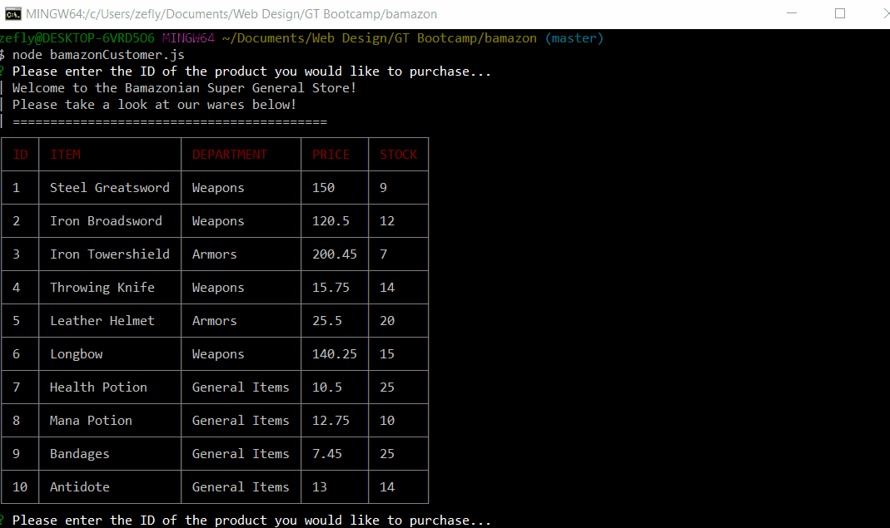

# bamazon
utilizing MySQL and Node.js to create a command-line operated storefront

## Making Purchases
Users can select from the list of items and specify the quantity

## Insufficient Quantity
If a user attemps to purchase more than the current stock of that item, they are redirected to the home menu

